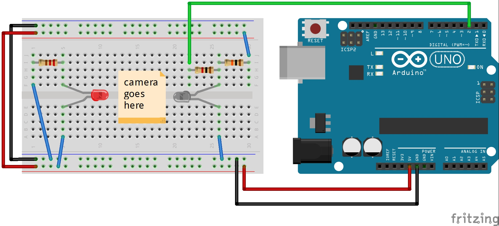

# Camera shutter time tester
This is a shutter speed tester for SLR cameras

## Components
 - laser diode (you can use an IR diode, just make sure to have a photodiode, that matches the wavelength)
 - photodiode
 - 1Kohm resistor (or whatever your photodiode requires)
 - 2x 10Kohm resistor
 - breadboard
 - helping hands
 - arduino uno
 - wires

## Using
1. Assemble the circuit (make sure the laser diode hits the photodiode right in the middle - you can measure the voltage across the photodiode to get the best result)
1. Place the led and the photodiode in the claws of the helping hands
1. Place the camera between the led and the photodiode, with the lens off, the back open, and the mirror down
1. Turn on the arduino
1. Connect the Arduino to the computer, and upload the sketch
1. Open the serial monitor and connect to the Arduino
1. Set the shutter speed
1. Pull the film advance lever
1. Fire away
1. Repeat for all the speeds you want

### Output
It will output something like this in the seial monitor:
(measuring a 1/30 speed)
```
...
waiting...

measuring...
Start: 69847068
Stop: 69879408
Microseconds: 32340 (0.03 s)
shutter speed: 1/30.92

waiting...
...
```
Where:
 - ```Microseconds...``` will give you the amount of microseconds (and seconds) the shutter was open
 - ```shutter speed...``` will give you the speed in stops

## Schematic


## Original notes
This is a camera shutter timer for an arduino microcontroller with a laser emitter module and a laser sensor.  I made a medium-embarassing youtube video about it for non-programmers here:  https://www.youtube.com/watch?v=UwOh3da_Y8s

